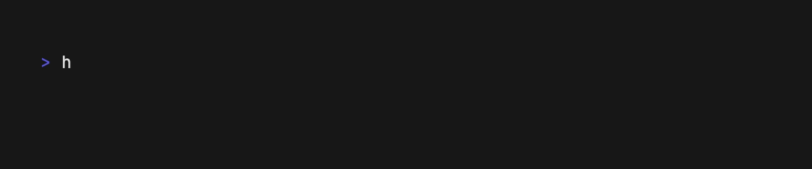
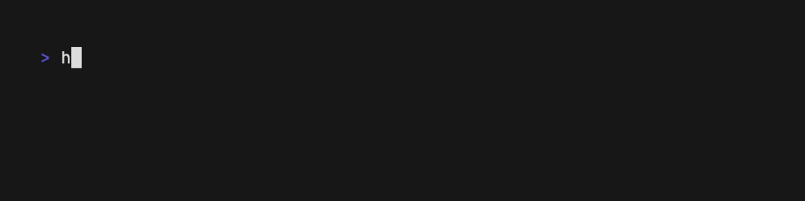

[](https://github.com/ksckaan1/hexago/releases)

[](https://goreportcard.com/report/github.com/ksckaan1/hexago)

[](https://github.com/ksckaan1/hexago/graphs/contributors)
[](./LICENSE)

Hexago is a CLI tool for you to create a Go project by applying hexagonal architecture.

## TOC
- [TOC](#toc)
- [Installation](#installation)
- [Dependencies](#dependencies)
- [Before We Start](#before-we-start)
- [Why Hexago?](#why-hexago)
- [Commands](#commands)
  - [`doctor`](#doctor)
  - [`init`](#init)
  - [`domain`](#domain)
  - [`port`](#port)
  - [`service`](#service)
  - [`app`](#app)
  - [`infra`](#infra)
  - [`pkg`](#pkg)
  - [`cmd`](#cmd)
  - [`run`](#run)
  - [`tree`](#tree)
- [Templates](#templates)
  - [Custom Templates](#custom-templates)
    - [Naming Custom Template](#naming-custom-template)
    - [Content of Custom Template](#content-of-custom-template)
    - [Selecting Custom Template to Use](#selecting-custom-template-to-use)


## Installation

```sh
go install github.com/ksckaan1/hexago@latest
```

## Dependencies
- [go](https://go.dev)
- [impl](https://github.com/josharian/impl)

> [!WARNING] 
> Make sure that the directory `$HOME/go/bin` is appended to the `$PATH` environment variable

## Before We Start

If you didn’t hear about hexagonal architecture before, firstly, you could research about it.

Here it is nice blog posts about hexagonal architecture:

- https://medium.com/ssense-tech/hexagonal-architecture-there-are-always-two-sides-to-every-story-bc0780ed7d9c
- https://dev.to/bagashiz/building-restful-api-with-hexagonal-architecture-in-go-1mij
- https://medium.com/@janishar.ali/how-to-architecture-good-go-backend-rest-api-services-14cc4730c05b

## Why Hexago?

Hexago can be used to create hexagonal Go projects in an organised way. In this way, you can follow certain standards and have a more manageable application development phase. It imposes its own rules for certain situations and as a result of these impositions, your project gains regularity.

You can also use Hexago only for creating hexagonal projects. It is your preference whether or not to bring it with hexago.

## Commands

- [doctor](#doctor)
- [init](#init)
- [domain](#domain)
  - [new](#new)
  - [ls](#ls)
- [port](#port)
  - [ls](#ls-1)
- [service](#service)
  - [new](#new-1)
  - [ls](#ls-2)
- [app](#app)
  - [new](#new-2)
  - [ls](#ls-3)
- [infra](#infra)
  - [new](#new-3)
  - [ls](#ls-4)
- [pkg](#pkg)
  - [new](#new-4)
  - [ls](#ls-5)
- [cmd](#cmd)
  - [new](#new-5)
  - [ls](#ls-6)
- [run](#run)
- [tree](#tree)

### `doctor`

The `doctor` command displays the status of dependencies that are required for hexago to run properly.

**Example:**


### `init`
The `init` command initialize a Hexago project. This command creates a domain named `core` by default. Promts go module name. If leaves blank, uses project folder name as lowercase defaultly.

```sh
hexago init <project-path>
```
**Example:**


### `domain`
This is the parent command for all domain-related operations.

If the project does not contain any domain, a new `service` and `app` cannot be created. For this, a domain must be created first.

- #### `new`

  This command creates a new domain under the `internal/domain` directory.

  ```sh
  hexago domain new
  ```

  

- #### `ls`
  
  This command lists all domains under the `internal/domain` directory.

  ```sh
  hexago domain ls
  ```
  **Flags:**
  - `-l`: lists domains line-by-line
  
  

### `port`
This is the parent command for all port-related operations.

Ports can be implemented when creating service, app, infrastructure and package. If there is no port in the project, it is not asked which port to implement in the creation screen.

You can create a port manually like bellow.

```go
// internal/port/user.go

package port

type UserController interface {
  CreateUser(w http.ResponseWriter, r *http.Request)
  GetUserByID(w http.ResponseWriter, r *http.Request)
  GetAllUsers(w http.ResponseWriter, r *http.Request)
  UpdateUserByID(w http.ResponseWriter, r *http.Request)
  DeleteUserByID(w http.ResponseWriter, r *http.Request)
}

type UserService interface {
  CreateUser(ctx context.Context, params dto.CreateUserParams) (string, error)
  GetUserByID(ctx context.Context, userID string) (*dto.User, error)
  GetAllUsers(ctx context.Context) ([]*dto.User, error)
  UpdateUserByID(ctx context.Context, params dto.UpdateUserParams) error
  DeleteUserByID(ctx context.Context, userID string) error
}

type UserRepository interface {
  CreateUser(ctx context.Context, params dto.CreateUserParams) (string, error)
  GetUserByID(ctx context.Context, userID string) (*dto.User, error)
  GetAllUsers(ctx context.Context) ([]*dto.User, error)
  UpdateUserByID(ctx context.Context, params dto.UpdateUserParams) error
  DeleteUserByID(ctx context.Context, userID string) error
}

```

You can use this port when creating a new service, app, infrastructure or package.

- #### `ls`:

  This command lists all ports under the `internal/port` directory.

  **Flags:**
  - `-l`: lists ports line-by-line

  


### `service`
This is the parent command for all service-related (domain-service) operations.

- #### `new`

  This command creates a new service under the `internal/domain/<domainname>/service/<servicename>` directory.

  Domain is required to create a service. Steps applied when creating a service:

  - Insert service name (PascalCase)
  - Insert folder name (lowercase)
  - Select a domain
  - Select port which will be implemented (skips this step if there is no port)
  - Assert port if selected

  ```sh
  hexago service new
  ```

  

- #### `ls`

  This command lists all services under the `internal/domain/<domainname>/service` directory.

  ```sh
  hexago service ls
  ```
  **Flags:**
  - `-l`: lists services line-by-line
  
  

### `app`
This is the parent command for all application-related (application-service) operations.

Application services are the places where endpoints such as controllers or cli applications are hosted.

- #### `new`

  This command creates a new application under the `internal/domain/<domainname>/app/<appname>` directory.

  Domain is required to create an application. Steps applied when creating an application:

  - Insert application name (PascalCase)
  - Insert folder name (lowercase)
  - Select a domain
  - Select port which will be implemented (skips this step if there is no port)
  - Assert port if selected

  ```sh
  hexago app new
  ```

  

- #### `ls`

  This command lists all applications under the `internal/domain/<domainname>/app` directory.

  ```sh
  hexago app ls
  ```
  **Flags:**
  - `-l`: lists applications line-by-line
  
  

### `infra`
This is the parent command for all infrastructure-related operations.

Infrastructures host databases (repositories), cache adapters or APIs that we depend on while writing applications

- #### `new`

  This command creates a new infrastructure under the `internal/infrastructure/<infraname>` directory.

  Steps applied when creating an infrastructure:

  - Insert infrastructure name (PascalCase)
  - Insert folder name (lowercase)
  - Select port which will be implemented (skips this step if there is no port)
  - Assert port if selected

  ```sh
  hexago infra new
  ```

  

- #### `ls`

  This command lists all infrastructures under the `internal/infrastructure` directory.

  ```sh
  hexago infra ls
  ```
  **Flags:**
  - `-l`: lists infrastructures line-by-line
  
  

### `pkg`
This is the parent command for all package-related operations.

Packages are the location where we host features such as utils. There are two types of packages in a hexago project. 
- The first one is located under `/internal/pkg` and is not imported by other go developers. Only you use these packages in the project.
- The second is located under `/pkg`. The packages here can be used both by your project and by other go developers.

- #### `new`

  This command creates a new package under the `internal/pkg/<pkgname>` or `/pkg/<pkgname>` directory.

  Steps applied when creating a package:

  - Insert package name (PascalCase)
  - Insert folder name (lowercase)
  - Select port which will be implemented (skips this step if there is no port)
  - Assert port if selected
  - Select package scope (global or internal)

  ```sh
  hexago pkg new
  ```

  

- #### `ls`

  This command lists all packages under the `internal/pkg` or `/pkg` directory.

  ```sh
  hexago pkg ls # list internal packages
  ```
  **Flags:**
  - `-g`: lists global packages
  - `-a`: list both global and internal packages.
  - `-l`: lists packages line-by-line
  
  

### `cmd`
This is the parent command for all entry point-related (cmd) operations.

Entry points are the places where a go application will start running. entry points are located under the `cmd` directory.

- #### `new`

  This command creates a new entry point under the `cmd/<entry-point-name>` directory.

  There is only one step creating an entry point.

  - Insert entry point folder name (kebab-case)

  Creates a go file like bellow.

  ```go
  package main

  import (
    "fmt"
    "os"
    "path/filepath"
    "strings"
  )

  func main() {
    fmt.Printf("Hello from %s!\n", strings.ToUpper(filepath.Base(os.Args[0])))
    if env, ok := os.LookupEnv("MY_ENV"); ok {
      fmt.Println("MY_ENV ->", env)
    }
  }

  ```

  ```sh
  hexago cmd new
  ```

  

- #### `ls`

  This command lists all entry points under the `cmd` directory.

  ```sh
  hexago cmd ls
  ```
  **Flags:**
  - `-l`: lists entry points line-by-line
  
  

### `run`
This command can be used for two different purposes. the `run` command create a log file under the `logs` directory defaultly.

- Firstly, if there is an entry point in your project, it can be used to run this entry point.

  ```sh
  hexago run <entry-point-name>
  ```

  

  **Flags:**
  - `-e`: run entry point with environment variable. You can use multiple environment variable
    ```sh
    hexago run <entry-point-name> -e <ENV_KEY1>=<ENV_VALUE1> -e <ENV_KEY2>=<ENV_VALUE2>
    ```

  
  
  You can customize this run command with given entry point in `.hexago/config.yaml` file.

  You can specify all envs from `config.yaml` file like bellow.

  ```yaml
  templates: # std | do | <custom>
  service: std
  application: std
  infrastructure: std
  package: std

  runners:
    api: # it runs "go run ./cmd/api", if exists
      env:
        - ENV_KEY1=ENV_VAL1
        - ENV_KEY2=ENV_VAL2
      log:
        disable: false # write logs to files
        seperate_files: true # create log files seperately as api.stderr.log and api.stdout.log
        overwrite: true # create new log file when runner called
  ```

  When the `hexago run api` command is executed as above, it starts the `api` entry point according to the settings in the `config.yaml` file.

- As a second method, you can use the `run` sub-command as an alternative to makefile. You can create a new entry in the `runners` section of the `.hexago/config.yaml` file to call it with the `run` command.

  The special commands created do not need to have an entry point equivalent. We can add a special command using the `cmd` key.

  ```yaml
  runners:
    custom-command:
      cmd: "go version" # overwrite default "go run ./cmd/mycommand/" command
      log:
        disabled: true # do not print log file
  ```

  When you run `hexago run custom-command` command, you will get the following result.

  ```text
  go version go1.23.0 darwin/arm64
  ```

### `tree`
This command prints hexagonal structure of project.

```sh
hexago tree
```


## Templates

When creating service, application, infrastructure and package with Hexago, templates are used to create go files.  Hexago has 2 built-in templates, `std` and `do`.

`std` template uses the standard go instance initialiser.

```go
package mypkg

type MyPkg struct{}

func New() (*MyPkg, error) {
  return &MyPkg{}, nil
}
```

`do` is a package that provides a dependency injection container. 

```go
package mypkg

import "github.com/samber/do"

type MyPkg struct{}

func New(i *do.Injector) (*MyPkg, error) {
  return &MyPkg{}, nil
}
```

Which template to use can be determined in the `.hexago/config.yaml` file.

```yaml
templates: # std | do | <custom>
  service: std
  application: do
  infrastructure: std
  package: do
```

### Custom Templates

If you want to use another template other than these templates, you can create your own template.

#### Naming Custom Template
Custom templates are hosted under the `.hexago/templates/` directory. There is a convention that must be used when naming the template file.

`.hexago/templates/<template-name>_<template-type>.tmpl`

Examples:

- `.hexago/templates/abc_service.tmpl`
- `.hexago/templates/abc_application.tmpl`
- `.hexago/templates/abc_infrastructure.tmpl`
- `.hexago/templates/abc_package.tmpl`

#### Content of Custom Template

For example, the `std` template is as follows.

```gotmpl
package {{.PkgName}}

{{if and .AssertInterface (ne .InterfaceName "") (ne .ImportPath "")}}
import "{{.ImportPath}}"

var _ port.{{.InterfaceName}} = (*{{.StructName}})(nil)
{{end}}

type {{.StructName}} struct{}

func New() (*{{.StructName}}, error) {
  return &{{.StructName}}{}, nil
}

{{ if ne .Implementation "" }}{{ .Implementation }}{{end}}
```

#### Selecting Custom Template to Use

To use the created custom template, you must specify the template name in `config.yaml`.

```yaml
templates: # std | do | <custom>
  service: abc
  application: std
  infrastructure: std
  package: std
```
